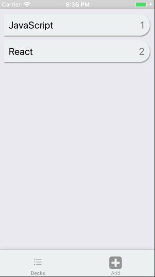
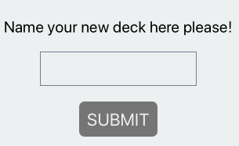
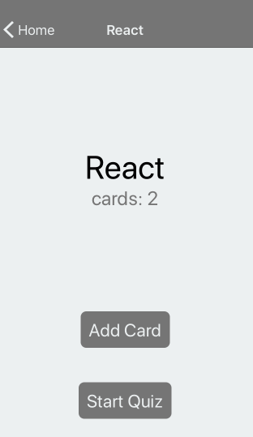
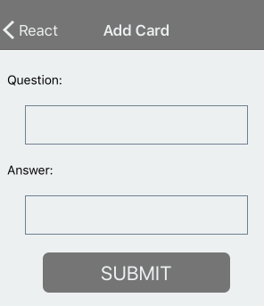
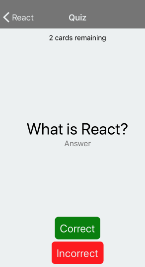
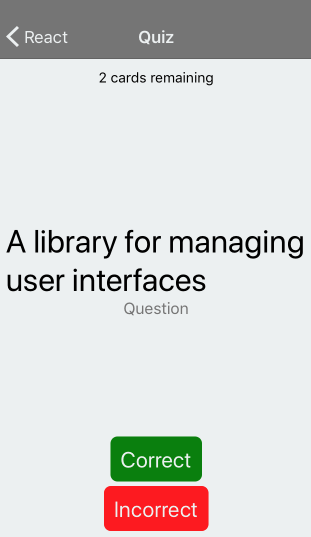

# MobiFlashCards

A mobile application (Android or iOS - or both) that allows users to study
collections of flashcards. The app will allow users to create different
categories of flashcards called "decks", add flashcards to those decks, then
take quizzes on those decks. (for Udacity Nanodegree program).
[Project overview can be found here](https://github.com/vvscode/js--mobile-flashcards/blob/master/docs/project-overview.pdf)

## Requirements

* Android or iOS emulators || Expo app installed on a physical device
* Node

## Installation

```js
npm install && npm start --reset-cache
```

## Project structure

```
.
├── App.js    - entire point of the application
├── README.md    - this file
├── actions    - directory to store action creators
│   ├── decks.js
│   └── index.js
├── app.json    - expo settings
├── components    - components directory
│   ├── Deck    - pod related to Decks
│   │   ├── AddDeck.js
│   │   ├── DeckList.js
│   │   ├── DecksListItem.js
│   │   ├── IndividualDeckView.js
│   │   └── index.js    - pod's entire point
│   ├── Quiz    - pod related to Quiz
│   │   ├── QuestionCreate.js
│   │   ├── QuizActive.js
│   │   ├── QuizFinale.js
│   │   ├── QuizQAFlipper.js
│   │   ├── QuizRemaining.js
│   │   ├── QuizScoring.js
│   │   ├── QuizView.js
│   │   └── index.js    - pod's entire point
│   └── common    - pod with common components
│       ├── StatusBar.js
│       ├── TextButton.js
│       ├── TextInButton.js
│       └── index.js    - pod's entire point
├── docs    - project-related documentation
│   ├── README.md
│   └── project-overview.pdf
├── eslintrc.js
├── images    - application screenshots
│   ├── 1.png
│   ├── 2.png
│   ├── 3.png
│   ├── 4.png
│   ├── 5.png
│   └── 6.png
├── package.json    - list of dependencies
├── reducers    - folder for reducers
│   └── index.js
└── utils    - utils directory
    ├── Navigator.js
    ├── api.js
    ├── colors.js
    ├── decks.js
    ├── helpers.js
    └── platform.js
```

## How it looks












